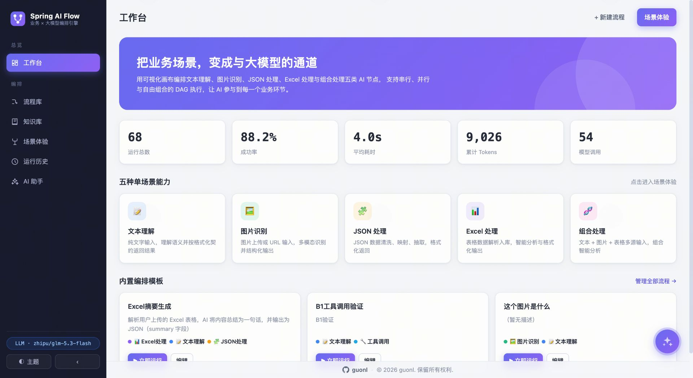
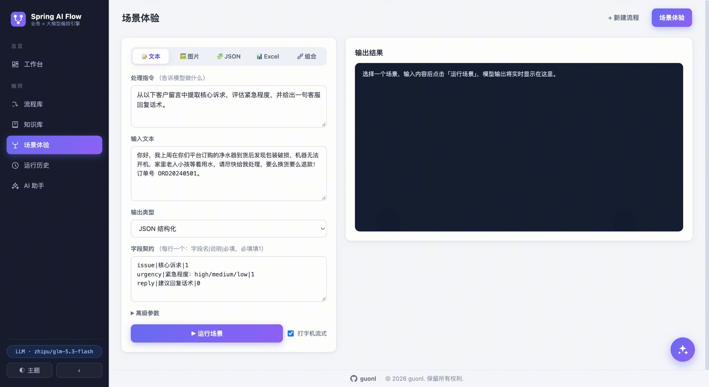
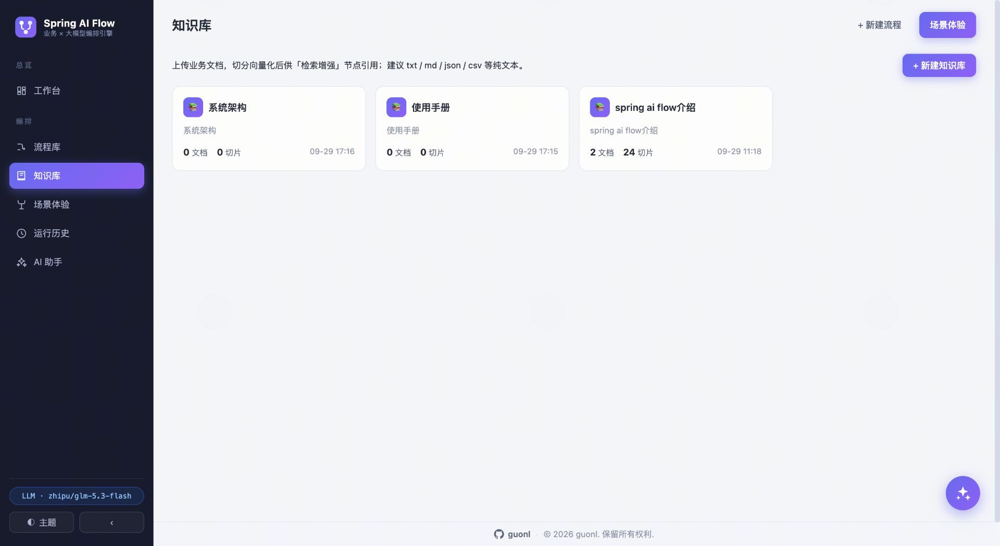
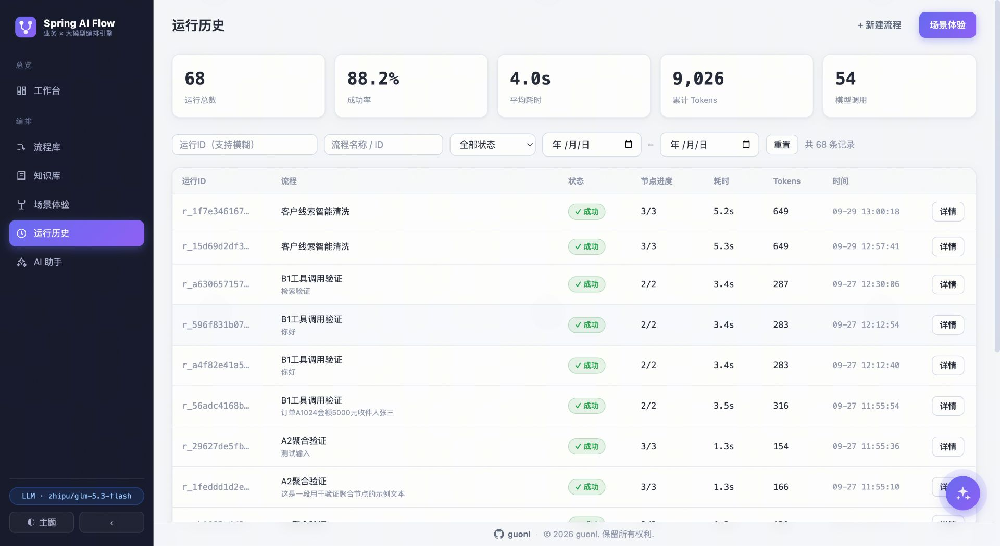
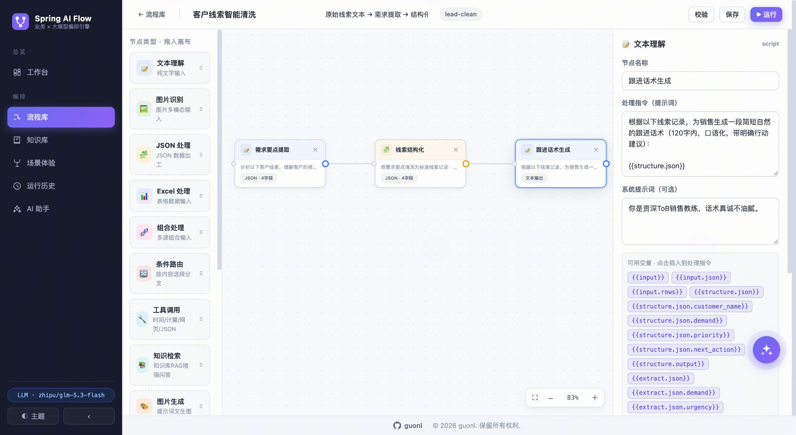
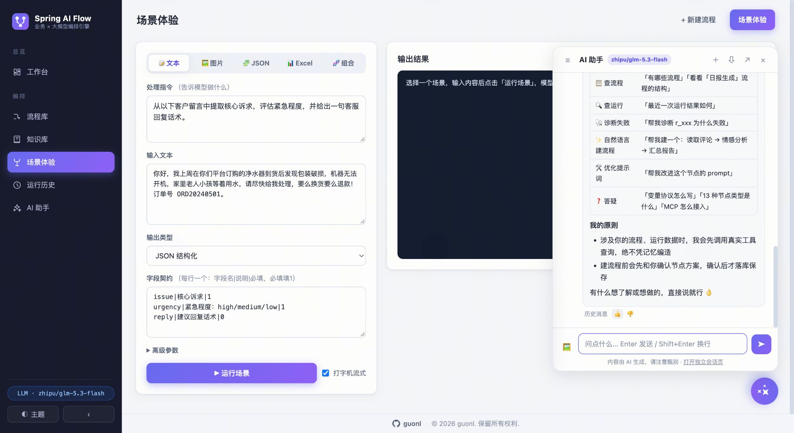
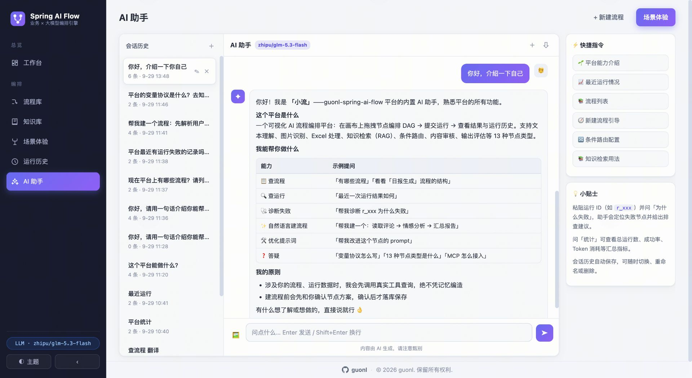
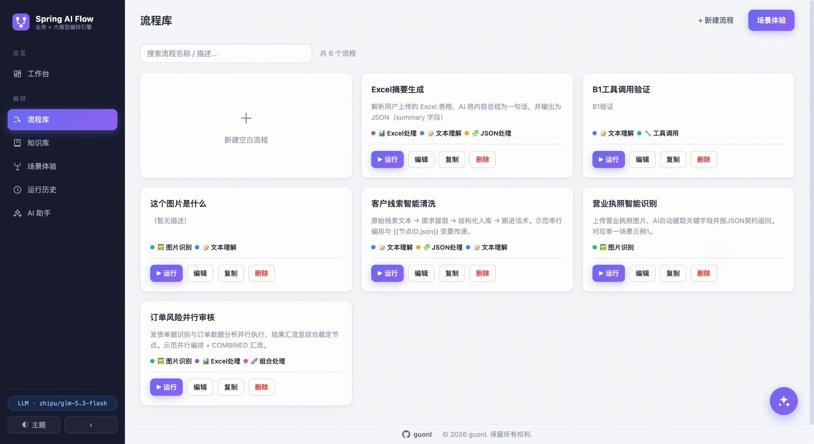

# 别再把大模型"焊死"在代码里：我用最新一代 Spring 技术栈，开源了一个可视化 AI 流程编排引擎

> 作者：guonl
> 项目地址：https://github.com/guonl/guonl-spring-ai-flow
> 技术栈声明：本文介绍的项目**全程基于当前最新的 Spring 生态构建**——Spring Boot 4.1.1 + Spring AI 2.0.1 + MCP 官方 Starter，没有一行"旧框架缝补"的妥协代码。

## 一、大模型落地的"最后一公里"

过去一年，几乎所有团队都完成了"接大模型"的第一步：写一段提示词、调一次 API、解析一次返回。但当业务真正要规模化使用 AI 时，问题才集中暴露：

- **提示词散落在各处代码里**。改一次措辞就要发一次版，业务人员完全无法参与调优；
- **链路靠胶水代码硬拼**。想做一个"识别营业执照 → 结构化入库 → 风险审核 → 生成话术"的流程，就要手写调度、重试、超时、上下文传递一堆样板代码；
- **调用过程是黑盒**。一次请求花了多少 Token、哪个环节慢了、失败在哪一步，只能翻日志考古；
- **能力重复造轮子**。知识库检索、工具调用、内容审核、多轮记忆，每个项目都要从零实现一遍。

这些问题的共同根因是：**大模型能力没有被"流程化"**。guonl-spring-ai-flow 正是冲着这一点来的——把大模型能力变成画布上可拖拽、可连线、可即时运行的节点，让业务场景以流程的方式与大模型对话。

## 二、它是什么

一句话：**一个开箱即用的可视化 AI 流程编排引擎**。单个 jar 启动，自带 Web 编排画布、运行观测、RAG 知识库与 MCP 协议集成，支持串行、并行、条件分支、汇流聚合等任意 DAG 编排形态。

核心能力速览：

| 能力域 | 说明 |
|---|---|
| 可视化编排 | 浏览器内拖拽节点、拉线连线、即时校验与运行 |
| 13 种节点类型 | 理解 / 控制 / 生成 / 安全四大类，覆盖业务全场景 |
| 变量协议与输出契约 | `{{变量}}` 引用任意上游产出，节点按 JSON 契约结构化返回 |
| RAG 知识库 | 文档上传 → 切片向量化 → 检索调试，一条龙内置 |
| 会话记忆 | 节点可携带同一会话最近 N 轮历史，JDBC 持久化 |
| MCP 双端集成 | 流程既能暴露为 MCP 工具，也能调用外部 MCP 工具 |
| 多模态 | 图片识别与生成、Excel 解析、音频上传自动转录、内容审核 |
| 双运行模式 | `mock` 零密钥全流程体验 / `llm` 直连 OpenAI 兼容端点 |
| 可靠性与可观测 | 双重重试 + 降级模型 + SSE 流式推送 + 全量执行明细入库 |

开箱即用的页面长这样——**工作台**一屏铺开统计总览、场景入口与示例模板：



## 三、技术栈：直接站在最新一代 Spring 生态上

这是本项目最想强调的一点。市面上不少 AI 编排工具基于旧的微服务框架加 AI 插件缝补而成，而 guonl-spring-ai-flow 从第一行代码起就构建在**当前最新的 Spring 技术栈**之上：

| 组件 | 版本 | 说明 |
|---|---|---|
| Java | 17（LTS） | 生产级长期支持版本 |
| Spring Boot | **4.1.1** | 当前最新大版本线，内嵌 Tomcat |
| Spring AI | **2.0.1** | 当前最新稳定版，统一的模型抽象层 |
| MCP | 官方 Server/Client Starter | Model Context Protocol，AI 工具互联标准协议 |
| 可观测基座 | Actuator + Micrometer | Spring AI 模型调用自动产生 `spring.ai.*` 指标 |
| API 文档 | springdoc-openapi 3.1.1 | Swagger UI 开箱即用 |
| 持久化 | MySQL 8 + MyBatis | 轻量可控的 SQL 映射 |
| 页面 | Thymeleaf + 原生 JS/CSS | 零 npm 依赖，无前端构建链 |

几个值得展开的点：

**1. Spring Boot 4.1.1：第一批"原生"吃螃蟹的项目**

项目直接基于 Spring Boot 4.x 大版本线构建，从依赖管理到自动装配全部走新一代体系。对使用者来说，这意味着更长的技术支持周期、更现代的默认配置，以及与最新 Spring 生态的无缝兼容——你不需要担心"这个项目还停留在 Boot 2 时代"的升级债。

**2. Spring AI 2.0.1：模型接入的唯一抽象层**

所有大模型交互都经由 Spring AI 的统一抽象：ChatClient、Embedding、ImageModel、ModerationModel、TranscriptionModel。带来三个直接收益：

- **换模型不改代码**：默认对接 OpenAI 兼容协议（`OPENAI_BASE_URL` 指向任意兼容网关即可），企业内网模型中转、第三方代理都能直连；
- **会话记忆开箱即用**：`spring-ai-starter-model-chat-memory-repository-jdbc` 把多轮对话历史持久化到 MySQL，按会话 ID 隔离，节点声明 `memoryTurns` 即生效；
- **向量存储走标准 SPI**：知识库基于 `spring-ai-vector-store`（SimpleVectorStore 落盘），后续切换 Milvus、PgVector 等实现只是换一个 starter。

**3. MCP 双端集成：站在 AI 工具互联的协议标准上**

MCP（Model Context Protocol）是当前 AI 工具生态的事实标准，本项目是目前少见的**同时实现 Server 与 Client 双端**的编排引擎：

- **作为 MCP Server**：编排好的流程一键暴露为 MCP 工具（`GET /api/mcp/tools` 可查清单），任何 MCP 客户端（IDE 助手、Agent 框架）都能直接调用你的业务流程；
- **作为 MCP Client**：发现并调用外部 MCP Server 的工具，作为工具调用节点的工具来源（`MCP_CLIENT_ENABLED` 开关控制）。

也就是说，你的流程既是"可以被 AI 调用的工具"，也能"调用别家 AI 的工具"——双向打通。

**4. SSE 流式：执行过程实时可见**

运行页通过 Server-Sent Events 实时推送每个节点的增量输出（`RunStreamHub` 广播 `nodeId + delta`），前端 EventSource 主用、异常自动降级轮询。配合节点级执行轨迹与 Token 统计，模型调用的每一步都透明可见，黑盒变成了"直播"。

**5. 零前端构建链**

服务端用 Thymeleaf 渲染，交互层是原生 JS/CSS——没有 webpack、没有 node_modules、没有版本锁。`git clone` 后一条 `mvn` 命令跑起来，对后端团队极其友好。

## 四、13 种节点类型，覆盖业务全场景

| 分类 | 节点 | 能力说明 |
|---|---|---|
| 模型理解 | 文本理解 | 纯文字输入，语义理解与结构化输出 |
| | 图片识别 | 多模态识别，图片 URL 或上传多选 |
| | JSON 处理 | JSON 清洗、映射、抽取 |
| | Excel 处理 | 表格解析与智能分析（Apache POI） |
| | 组合处理 | 文本 + 图片 + 表格多源素材组合输入 |
| 控制与增强 | 条件路由 | 模型自主选择分支，按 `{"route":"分支名"}` 激活下游 |
| | 工具调用 | 内置时间 / 计算 / 网页抓取 / JSONPath 工具，模型按需调用 |
| | 知识检索 | RAG：向量召回知识库片段增强问答 |
| | 子流程 | 把已有流程当"宏"复用 |
| | 聚合 | 不经模型直接合并多上游输出（拼接 / JSON 合并 / 模板渲染），零 Token |
| 生成与安全 | 图片生成 | 提示词文生图，产出可下载 |
| | 内容审核 | Moderation SPI 违规类别检测分流 |
| | 输出评估 | LLM-as-judge 质量打分 |

引擎侧的编排能力同样完整：入度驱动拓扑调度让无依赖节点天然并行，失败级联取消、节点超时（默认 180s）、条件路由兜底默认分支——这些在画布上都只是"拉一根线"的事。

**流程编辑器画布**实貌——拖拽节点、拉线连线、即时校验与运行：



## 五、几个值得细看的设计

**变量协议，零模板成本。** 提示词里写 `{{input}}`、`{{节点A.output.json.字段}}` 即可引用输入与任意上游产出（支持跨层下钻）；没用到的变量会被自动追加上下文段而不是报错，删节点不用改下游提示词。

**输出契约 + 双重重试。** 节点声明 JSON 字段契约（字段名 / 说明 / 必填），模型按契约结构化返回；解析失败自动重试，退避可配，还能指定降级模型兜底——把"模型偶尔不听话"从线上事故变成了可配置的策略。

**mock / llm 双模式。** `FLOW_AI_PROVIDER=mock` 一行环境变量，无需任何模型密钥即可完整体验全部页面与流程（数据为模拟结果）；切换 `llm` 即接真实模型。演示、开发、测试、生产四种场景一套代码。

**知识库一条龙。** 上传文档（txt/md/json/csv/yml/xml/html）→ 自动切片向量化落盘 → 页面上直接做检索调试（query + TopK）→ 流程里挂"知识检索"节点即可引用。RAG 的三块拼图一次配齐。

**知识库页面**：上传 → 向量化进度 → 检索调试，全程可视化：



**可观测三件套。** 运行页 SSE 流式直播；运行历史支持运行 ID / 流程 / 状态 / 时间范围四条件分页检索；工作台聚合运行总数、成功率、平均耗时、累计 Tokens、模型调用五项指标，全量节点执行明细落库可回溯。

**运行页**（SSE 流式直播每个节点的增量输出）与**运行历史**（运行 ID / 流程 / 状态 / 时间范围四条件检索）：





**AI 助手。** 平台还内置了全站悬浮窗 + `/assistant` 独立会话页的 AI 助手：SSE 流式对话 + 多轮记忆，可查流程、诊断运行、按自然语言建流程。



## 六、三分钟上手

```bash
# 1. 克隆并初始化数据库（建库 + 五张业务表 + 3 个示例流程）
git clone https://github.com/guonl/guonl-spring-ai-flow.git
cd guonl-spring-ai-flow
mysql -uroot -p < sqls/01_ddl.sql
mysql -uroot -p < sqls/02_dml.sql

# 2. 启动（无模型密钥？mock 模式全功能体验）
mvn -DskipTests package
FLOW_AI_PROVIDER=mock java -jar target/guonl-spring-ai-flow-*.jar
```

打开 http://localhost:8080 即进入工作台；`FLOW_AI_PROVIDER=llm` 并配置 `OPENAI_API_KEY` / `OPENAI_BASE_URL` 即切真实模型；Swagger 文档在 /swagger-ui.html。

想先试单个节点的能力？**场景体验**页支持即席调试，无需先建流程：



内置 3 个示例流程，覆盖三种典型编排形态：

- **license-ocr 营业执照智能识别**：图片识别 → JSON 结构化（串行）；
- **lead-clean 客户线索智能清洗**：文本理解 → JSON 入库 → 跟进话术（链式）；
- **order-risk 订单风险并行审核**：图片 + Excel 并行审核 → 综合风险裁定（并行汇流）。

这些流程在**流程库**中以卡片管理，支持关键词检索与分页：



## 七、它适合谁

- **后端团队**：想把大模型能力快速接入业务系统，又不想维护一堆提示词胶水代码；
- **业务 / 运营团队**：希望在画布上自助调整 AI 流程（改提示词、调分支、换知识库），不依赖发版；
- **平台团队**：需要把多个 AI 能力沉淀为标准流程，并通过 MCP 统一暴露给上层 Agent 与 IDE 工具调用；
- **学习者**：想系统了解 Spring AI 2.x、MCP 双端、SSE 流式、RAG 工程化的完整落地范式——这个项目本身就是一个可运行的最佳实践样例。

## 八、结语

大模型的能力在爆炸式增长，但真正决定落地效果的，是把能力"编排进业务"的工程效率。guonl-spring-ai-flow 用最新一代 Spring 技术栈给出了一个轻量、透明、开箱即用的答案：**一个 jar，一块画布，把你的业务场景变成与大模型的通道。**

项目完全开源，欢迎 Star、Fork 与 Issue 交流：

> GitHub：https://github.com/guonl/guonl-spring-ai-flow
